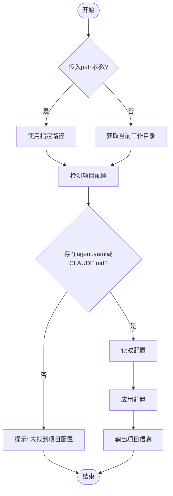

# 🔄 /flow:load-project - 项目配置加载器

## 功能说明

加载指定项目目录下的 `agent.yaml` 和 `CLAUDE.md` 配置。支持手动指定路径或自动检测当前目录。

## 使用方式

### 方式1: 指定项目路径（推荐）
```
/flow:load-project /tmp/wechatpad_test/WeChatPadPro
```

### 方式2: 自动检测当前目录
```
/flow:load-project
```

## 参数说明

| 参数 | 类型 | 必填 | 说明 |
|------|------|------|------|
| `path` | string | 否 | 项目根目录绝对路径。不传则检测当前目录 |

## 执行流程



## 配置检测顺序

按优先级检测以下文件：
1. `{path}/agent.yaml`
2. `{path}/CLAUDE.md`
3. `{path}/.kimi/agent.yaml`

## 使用示例

### 示例1: 加载 WeChatPadPro 项目
```
用户: /flow:load-project /tmp/wechatpad_test/WeChatPadPro

AI:
🔍 加载项目配置: /tmp/wechatpad_test/WeChatPadPro

✅ 发现配置文件:
  📄 CLAUDE.md
  📄 agent.yaml

📖 正在读取项目文档...
  ✅ Master Plan.md
  ✅ User Journey.md
  ✅ Implementation Plan.md
  ✅ Design Guidelines.md
  ✅ Task.md

🔄 项目配置已加载!

📋 项目: WeChatPadPro
⚡ 8条强制规则已激活

💡 当前操作将遵守 WeChatPadPro 项目规范
```

### 示例2: 检测当前目录
```
用户: /flow:load-project

AI:
🔍 检测当前目录项目配置...
📍 当前路径: /Users/yuhao/aiGroup/max

❌ 未找到项目配置
   当前目录不是项目根目录

💡 提示: 请指定项目路径
   例如: /flow:load-project /tmp/wechatpad_test/WeChatPadPro
```

### 示例3: 路径不存在
```
用户: /flow:load-project /nonexistent/path

AI:
❌ 路径不存在: /nonexistent/path

请确认项目路径正确
```

## 输出格式

成功时输出：
```
🔄 已加载项目配置
━━━━━━━━━━━━━━━━━━━━━━━━━━━━━━━━━━
📁 项目: {project_name}
📍 路径: {project_path}
📋 配置: {config_files}

⚡ 强制规则:
  • 规则1: xxx
  • 规则2: xxx
  ...

💡 提示: 当前操作将受到上述规则约束
━━━━━━━━━━━━━━━━━━━━━━━━━━━━━━━━━━
```

## 应用场景

### 场景1: 麦克斯协调 WeChatPadPro
```
[在 aiGroup/max 目录]
麦克斯: /flow:load-project /tmp/wechatpad_test/WeChatPadPro
麦克斯: Spawn 贾维斯执行后端开发
→ 贾维斯自动遵循 WeChatPadPro 规范
```

### 场景2: 快速切换项目
```
用户: /flow:load-project /project/A
[操作A项目...]

用户: /flow:load-project /project/B  
[操作B项目...]
```

## 等效命令

| 命令 | 说明 |
|------|------|
| `/flow:load-project /path/to/project` | 指定路径加载 |
| `/flow:load-project` | 检测当前目录 |
| `/flow:load /path` | 快捷命令 |

## 注意事项

1. **参数可选** - 不传参数则检测当前目录
2. **路径需存在** - 会检查路径有效性
3. **配置可选** - 无配置时输出提示，不报错
4. **会话有效** - 配置仅当前会话有效
5. **覆盖提示** - 重复加载会覆盖之前的配置

---

**版本**: v1.0  
**维护者**: 麦克斯 (Max)  
**适用范围**: aiGroup团队跨项目开发
