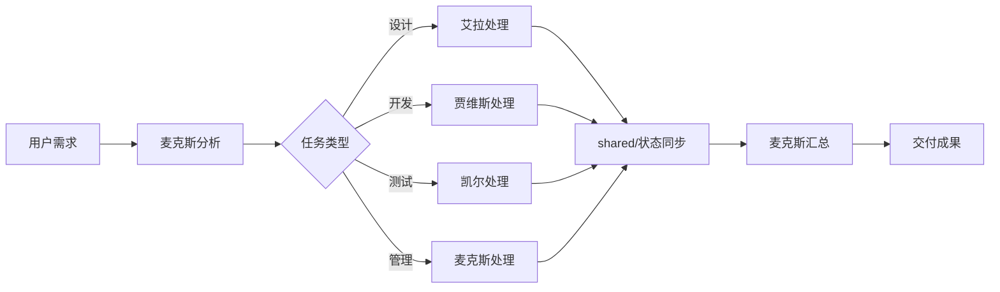

# aiGroup - AI团队协作系统

> 🚀 四AI专业分工协作框架：设计 + 开发 + 测试 + 管理

## 🌟 项目特色

### 核心创新
- **严格职责边界**: 每个AI只处理专属领域任务，避免能力重叠
- **智能Token优化**: 独创优化策略，实现67-85%成本削减
- **任务处理策略**: 基于复杂度的模型选择和任务分解机制
- **状态化协作**: 通过shared工作区实现AI间信息传递
- **专属技能库**: 每个AI配备专业技能，支持高级工作流程

### 与常见AI使用方式的区别
| 常见方式 | aiGroup |
|---------|---------|
| 一个AI处理所有任务 | 四AI专业分工，职责明确 |
| 随意使用模型 | 基于任务复杂度智能选择 |
| 无成本意识 | Token优化策略，成本可控 |
| 重复沟通上下文 | 持续状态管理，减少重复 |

---

## 👥 团队成员与职责边界

### 🎯 **麦克斯 (Max)** - 项目经理 & 产品顾问
**模型**: Sonnet 4.5 | **职责范围**: 管理和协调

**负责任务**:
- 📋 **项目管理**: 监控进度、识别风险、协调资源
- 💡 **产品顾问**: 需求分析、优先级排序、方向建议
- 📅 **个人助理**: 会议管理、待办事项、日程提醒
- 📊 **数据分析**: 团队效率分析、成本控制

**不负责**: UI设计、代码开发、测试验收

**🔧 专属技能**:
- CCPM项目管理系统（GitHub Issues集成）
- PM Claude技能集（节省8-9小时/周）
- 快速工具箱（交互式菜单）

### 🎨 **艾拉 (Ella)** - UI/UX设计师
**模型**: Sonnet 4.5 | **职责范围**: 设计创作

**负责任务**:
- 🎨 **UI设计**: 界面布局、视觉规范、组件设计
- 👤 **UX设计**: 用户体验流程、交互逻辑
- 🎭 **品牌设计**: 色彩搭配、字体选择、风格统一
- 📱 **响应式设计**: 多设备适配、移动优先

**不负责**: 代码实现、项目管理、测试验收

**🔧 专属技能**:
- 高级前端设计技能（React/Vue组件设计）
- UI/UX设计系统化方法
- 响应式布局和交互设计

### ⚡ **贾维斯 (Jarvis)** - 全栈开发工程师
**模型**: Sonnet 4.5 | **职责范围**: 技术实现

**负责任务**:
- 💻 **前端开发**: React/Vue/Angular，现代框架
- 🔧 **后端开发**: Node.js/Python/Java，API设计
- 🗄️ **数据库**: SQL/NoSQL，数据建模
- ☁️ **部署运维**: Docker/云服务，自动化部署

**不负责**: UI设计、项目管理、测试策略

**🔧 专属技能**:
- Claude Simone开发框架（AI辅助开发）
- 完整工程技能集（后端/全栈/架构/代码审查）
- DevOps和技术栈评估

### 🔍 **凯尔 (Kyle)** - 质量保证工程师
**模型**: Sonnet 4.5 | **职责范围**: 质量控制

**负责任务**:
- 🧪 **功能测试**: 核心业务逻辑验证
- 🔍 **代码审查**: 安全漏洞、性能问题检查
- 📋 **验收测试**: 用户需求完整性验证
- 📊 **质量报告**: 系统化测试文档输出

**不负责**: 代码开发、UI设计、项目规划

---

## 💰 Token优化策略

### 🎯 优化成果
- **综合节省**: 67-85% Token成本削减
- **三层策略**: 基础选择(30-40%) + 质量平衡(15-25%) + Task分解(20-40%)
- **实战验证**: 基于实际项目优化经验

### 📊 各AI优化数据
| 成员 | 优化率 | 核心策略 |
|------|--------|----------|
| 麦克斯 | 75% | 结构化管理、批量操作、预授权 |
| 艾拉 | 65% | 设计系统化、API直取、模板复用 |
| 贾维斯 | 60% | 代码复用、模块化开发、精准实现 |
| 凯尔 | 70%+ | 聚焦测试、模板化报告、智能文件读取 |

### 核心优化原则
1. **模型智能选择**: 根据任务复杂度选择Haiku/Sonnet/Opus
2. **任务分解策略**: 复杂任务分解为简单子任务，差异化模型处理
3. **需求澄清机制**: 避免过度设计，精准满足用户需求
4. **状态化管理**: 减少重复查询和上下文重建

---

## 🚀 任务处理策略

### 📋 任务分配原则
```
用户需求 → 麦克斯分析 → 分配给对应AI → 执行 → 麦克斯汇总
```

**分配规则**:
- 设计类需求 → 艾拉处理
- 开发类需求 → 贾维斯处理
- 测试类需求 → 凯尔处理
- 管理类需求 → 麦克斯处理

### ⚡ 模型选择策略

**决策树**:
```
任务复杂度评估
├─ 简单操作 (文件读写、格式化) → Haiku
├─ 中等复杂 (分析、设计、开发) → Sonnet
└─ 高度复杂 (战略决策、创新设计) → Opus (需确认)
```

**选择原则**:
- **质量优先**: 关键任务保证输出质量
- **成本意识**: 避免过度使用高成本模型
- **效率平衡**: 在质量和成本间找到最佳平衡

---

## 🚀 快速开始

### 基础命令
```bash
# 克隆项目
git clone https://github.com/yezannnnn/agnetGroup.git
cd agnetGroup

# 启动特定AI
claude --project max      # 项目管理和个人助理
claude --project ella     # UI/UX设计
claude --project jarvis   # 开发任务
claude --project kyle     # 测试验收
```

### 📋 可用技能命令
每个AI都有专属技能，通过斜杠命令调用：

**麦克斯技能**:
- `/status` - 查看团队状态汇总
- `/report` - 生成项目报告
- `/meeting` - 记录会议
- `/todo` - 管理待办事项
- `/suggest` - 提供产品建议

**艾拉技能** (UI/UX设计):
- `/design` - UI/UX设计和原型制作
- `/prototype` - 交互原型制作
- `/handoff` - 设计交付和规范

**贾维斯技能** (全栈开发):
- `/code` - 代码开发和架构设计
- `/deploy` - 部署和运维管理
- `/debug` - 代码调试和性能优化
- `/review` - 代码审查和质量检查

**凯尔技能** (质量保证):
- `/test` - 功能测试和自动化测试
- `/review` - 代码审查和安全检查
- `/verify` - PRD验收和需求验证
- `/report` - 质量报告和测试文档

---

## 📁 项目结构

```
aiGroup/
├── 📋 README.md           # 项目介绍
├── 🔒 .gitignore          # 精准版本（11行解决方案）
├── 📜 LICENSE             # 开源协议
│
├── 👨‍💼 max/               # 麦克斯配置
│   ├── CLAUDE.md          # 行为指令
│   ├── PERSONA.md         # 人格设定
│   └── skills/            # 专属技能
│
├── 🎨 ella/               # 艾拉配置
├── ⚡ jarvis/             # 贾维斯配置
├── 🔍 kyle/               # 凯尔配置
│
├── 🤝 shared/             # 共享工作区
│   ├── status.json        # 团队状态（实时同步）
│   ├── tasks/             # 任务管理
│   ├── docs/              # 文档库
│   ├── designs/           # 设计资源
│   └── reviews/           # 测试报告
│
└── 🛠️ scripts/            # 项目工具
    ├── check-gitignore.sh # 规则验证
    └── clean-system-files.sh # 文件清理
```

---

## 🔄 协作流程



### 典型工作流
1. **需求分析** → 麦克斯分析需求，确定任务类型
2. **任务分配** → 根据职责边界分配给对应AI
3. **专业处理** → 各AI在职责范围内处理任务
4. **状态同步** → 通过shared工作区同步进展
5. **成果汇总** → 麦克斯整合各AI成果，交付用户

---

## 💡 使用建议

### 🎯 最佳实践
- **明确角色**: 直接找对应AI，避免跨职责请求
- **利用状态**: 查看`shared/status.json`了解团队进展
- **遵循边界**: 尊重各AI的职责范围
- **成本意识**: 关注Token消耗，合理选择模型

### ⚠️ 职责边界提醒
- 设计问题不要问贾维斯或凯尔
- 代码问题不要问艾拉或麦克斯
- 测试问题不要问艾拉或贾维斯
- 管理问题不要问艾拉、贾维斯或凯尔

### 🚫 Token浪费防护
- 避免过度设计：用户要简单方案就给简单方案
- 需求澄清：模糊需求先问清楚再执行
- 复杂度评估：>1000 tokens任务先确认范围

---

## 📄 许可证

本项目采用 MIT 许可证 - 查看 [LICENSE](LICENSE) 文件了解详情。

---

*🚀 让每个AI在专业领域发挥最大价值，实现高效协作！*