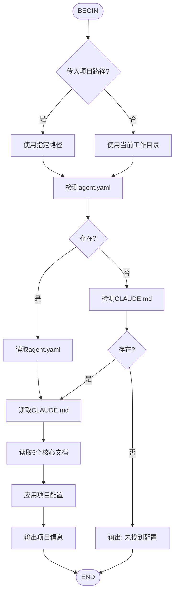

# 🔄 /flow:load-project - 项目配置加载器

## 流程图



---

## 执行步骤

### 步骤1: 确定项目路径

**判断逻辑**:
```
IF (用户传入了路径参数) THEN
    project_path = 用户传入的路径
ELSE
    project_path = 当前工作目录
END IF
```

**输出格式**:
```
📁 项目路径: {project_path}
```

---

### 步骤2: 检测项目配置

**检测顺序**:
1. `{project_path}/agent.yaml`
2. `{project_path}/CLAUDE.md`

**输出格式**:
```
🔍 检测项目配置...
✅ 发现配置文件: {文件名}
```

**如果未找到**:
```
❌ 未找到项目配置
   路径: {project_path}
   未找到 agent.yaml 或 CLAUDE.md
```

---

### 步骤3: 完整读取项目配置

**操作**: ReadFile `{project_path}/CLAUDE.md` (完整读取，不限制行数)

**说明**: 
- 必须完整读取 CLAUDE.md 全部内容
- 提取所有强制规则和行为规范
- 不设置 n_lines 限制，确保获取完整配置

**提取信息**:
- 项目名称
- 强制规则列表（完整8条）
- 相关文档路径
- 项目特殊要求

---

### 步骤4: 读取5个核心文档

**操作**: 按顺序读取以下文档（如存在）

```
ReadFile: {project_path}/docs/Master Plan.md
ReadFile: {project_path}/docs/User Journey.md
ReadFile: {project_path}/docs/Implementation Plan.md
ReadFile: {project_path}/docs/Design Guidelines.md
ReadFile: {project_path}/docs/Task.md
```

**输出格式**:
```
📖 读取项目文档:
  ✅ Master Plan.md - 项目总体规划
  ✅ User Journey.md - 用户旅程地图
  ✅ Implementation Plan.md - 技术实施计划
  ✅ Design Guidelines.md - 设计规范
  ✅ Task.md - 开发任务清单
```

---

### 步骤5: 应用配置并输出

**输出格式**:
```
🔄 项目配置已加载
━━━━━━━━━━━━━━━━━━━━━━━━━━━━━━━━━━
📁 项目: {project_name}
📍 路径: {project_path}
📋 配置: {config_files}

⚡ 强制规则:
  • 规则1: {rule1}
  • 规则2: {rule2}
  • 规则3: {rule3}
  ...

💡 提示: 当前操作将受到上述规则约束
━━━━━━━━━━━━━━━━━━━━━━━━━━━━━━━━━━
```

---

## 使用方式

### 方式1: 指定项目路径（推荐）
```
/flow:load-project /tmp/wechatpad_test/WeChatPadPro
```

### 方式2: 自动检测当前目录
```
/flow:load-project
```

---

## 等价命令

| 命令 | 说明 |
|------|------|
| `/flow:load-project /path` | 指定路径加载 |
| `/flow:load-project` | 检测当前目录 |
| `/skill:project-loader` | 查看Skill说明 |

---

## 示例输出

### 成功加载 WeChatPadPro
```
📁 项目路径: /tmp/wechatpad_test/WeChatPadPro

🔍 检测项目配置...
✅ 发现配置文件: CLAUDE.md, agent.yaml

📖 读取项目文档:
  ✅ Master Plan.md - 项目总体规划
  ✅ User Journey.md - 用户旅程地图
  ✅ Implementation Plan.md - 技术实施计划
  ✅ Design Guidelines.md - 设计规范
  ✅ Task.md - 开发任务清单

🔄 项目配置已加载
━━━━━━━━━━━━━━━━━━━━━━━━━━━━━━━━━━
📁 项目: WeChatPadPro
📍 路径: /tmp/wechatpad_test/WeChatPadPro/
📋 配置: CLAUDE.md, agent.yaml

⚡ 强制规则:
  • 规则1: 执行前必须阅读5个核心文档
  • 规则2: 代码改动需确认
  • 规则3: Git提交需yh授权
  • 规则4: 删除操作需授权
  • 规则5: 数据库操作需授权
  • 规则6: 网络配置需授权
  • 规则7: 文档必须放doc/目录
  • 规则8: 任务完成需更新Task.md

💡 提示: 当前操作将受到上述规则约束
━━━━━━━━━━━━━━━━━━━━━━━━━━━━━━━━━━
```

---

## 注意事项

1. **参数可选** - 不传参数则检测当前目录
2. **路径需存在** - 会检查路径有效性
3. **配置可选** - 无配置时输出提示，不报错
4. **会话有效** - 配置仅当前会话有效

---

**版本**: v1.0  
**维护者**: 麦克斯 (Max)  
**适用范围**: aiGroup团队跨项目开发
