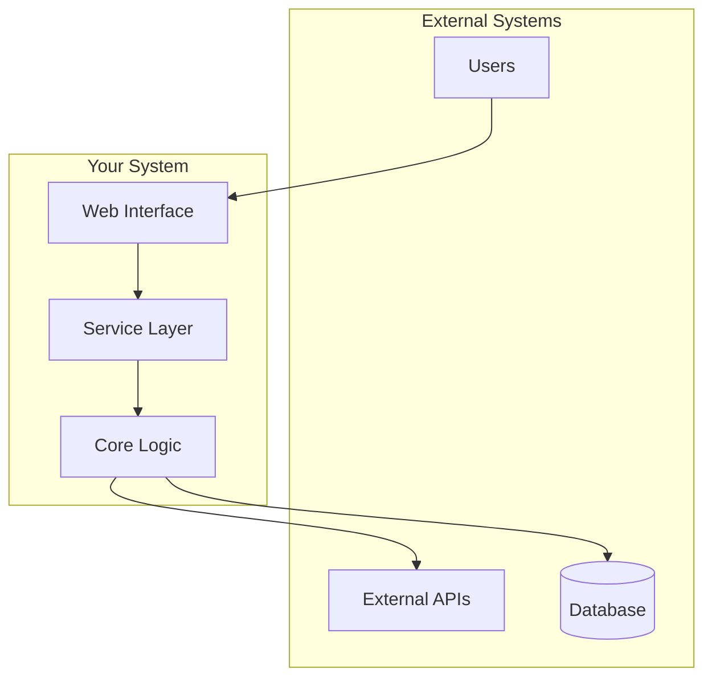
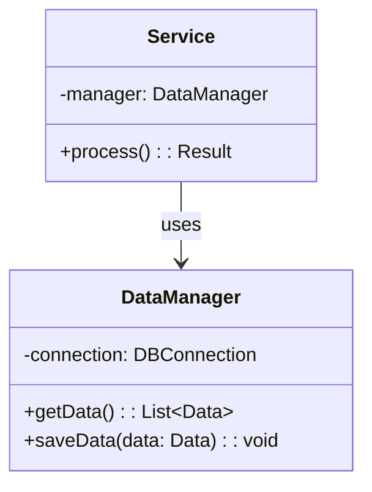

# Create, Update, and Maintain Mermaid Diagrams

Follow these instructions from top to bottom to generate, update, or maintain mermaid diagrams in the project's architecture documentation.

## Create a TODO with EXACTLY these 8 items

1. Parse arguments and determine action type
2. Analyze project structure and existing diagrams
3. Identify diagram scope and requirements
4. Create or update mermaid diagram code
5. Validate diagram syntax and rendering
6. Update cross-references and documentation
7. Apply diagram standards and styling
8. Report results and provide next steps

---

## 1 · Parse arguments and determine action type

Check <$ARGUMENTS> to determine the requested action:

- **CREATE**: Generate new architecture diagrams from scratch
- **UPDATE**: Modify existing diagrams based on code changes
- **MAINTAIN**: Review and refresh diagrams for accuracy
- **Empty**: Analyze project and recommend action

**If arguments specify a component/module**: Focus on that specific area
**If arguments are general**: Perform comprehensive diagram work

## 2 · Analyze project structure and existing diagrams

**Check existing diagram locations:**

All architecture diagrams should be in `/docs/architecture/`:

```
docs/architecture/
├── README.md                           # Main architecture overview
├── context_diagram.md                  # System context & data flow
├── module_overview.md                  # Module relationships
└── class_diagrams/
    ├── core_classes.md                 # Database, DAOs, data processing
    ├── data_models.md                  # Domain models & database schema
    └── service_layer.md                # UI architecture & service coordination
```

**Analyze the codebase using PARALLEL SUBAGENTS:**

- SCAN project structure to understand architecture
- IDENTIFY key components, modules, and services
- CHECK existing diagrams for outdated information
- FIND new additions that need documentation

## 3 · Identify diagram scope and requirements

Based on analysis, determine what diagrams need work:

**For CREATE action:**

- System context diagram showing external interactions
- Module overview for internal architecture
- Class diagrams for key subsystems
- Data flow diagrams if applicable

**For UPDATE action:**

- Compare existing diagrams with current code
- Identify new components, removed elements, changed relationships
- Mark diagrams that need modification

**For MAINTAIN action:**

- Review all diagrams for accuracy
- Check naming consistency
- Verify relationships and dependencies
- Update documentation strings

## 4 · Create or update mermaid diagram code

**Example System Context Diagram:**



**Example Class Diagram:**



**Best Practices:**

- Keep diagrams focused and readable
- Use consistent naming conventions
- Group related components
- Add brief descriptions where helpful
- Use appropriate diagram types for the content

## 5 · Validate diagram syntax and rendering

**Validation checks:**

- Ensure mermaid syntax is correct
- Preview diagrams in markdown viewer
- Check that all components are represented
- Verify relationships are accurate
- Confirm layout is clear and logical

**Common issues to check:**

- Missing semicolons or brackets
- Incorrect arrow syntax
- Undefined node references
- Circular dependencies clearly shown
- Proper escaping of special characters

## 6 · Update cross-references and documentation

**Update README.md in `/docs/architecture/`:**

- Add links to all diagram files
- Include brief description of each diagram
- Provide navigation structure
- Add update timestamp

**Example README structure:**

```markdown
# Architecture Documentation

Last Updated: [DATE]

## Available Diagrams

1. [System Context](./context_diagram.md) - External interfaces and data flow
2. [Module Overview](./module_overview.md) - Internal module structure
3. Class Diagrams:
   - [Core Classes](./class_diagrams/core_classes.md)
   - [Data Models](./class_diagrams/data_models.md)
   - [Service Layer](./class_diagrams/service_layer.md)
```

## 7 · Apply diagram standards and styling

**Consistent styling guidelines:**

**Color scheme:**

- External systems: `#E8F4F8`
- Core components: `#B8E0D2`
- Services: `#D4E8D9`
- Data stores: `#F0E6D2`

**Node naming:**

- Use PascalCase for classes
- Use UPPER_CASE for systems
- Use descriptive names
- Avoid abbreviations

**Layout principles:**

- Top-to-bottom for hierarchies
- Left-to-right for workflows
- Group related components
- Minimize crossing lines

## 8 · Report results and provide next steps

Create a summary report:

```
Mermaid Diagram Update Report
============================

Action Performed: [CREATE/UPDATE/MAINTAIN]
Date: [YYYY-MM-DD]

Diagrams Created/Updated:
- [ ] System Context Diagram
- [ ] Module Overview
- [ ] Core Classes
- [ ] Data Models
- [ ] Service Layer

Changes Made:
- [List key changes]

Validation Status:
- ✓ All diagrams render correctly
- ✓ Cross-references updated
- ✓ README.md updated

Next Steps:
1. Review diagrams in rendered markdown
2. Update if project structure changes
3. Consider additional detail diagrams for complex areas
```

**Maintenance recommendations:**

- Update diagrams with each major feature
- Review quarterly for accuracy
- Add new diagrams for new subsystems
- Keep diagrams synchronized with code

## Quick Reference Commands

```bash
# Generate all architecture diagrams
/simone:mermaid CREATE

# Update existing diagrams
/simone:mermaid UPDATE

# Maintain and validate diagrams
/simone:mermaid MAINTAIN

# Focus on specific component
/simone:mermaid UPDATE authentication
```
