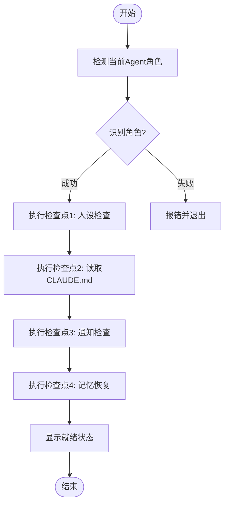

# 🚀 /flow:start - 通用启动流程

> 自动检测当前Agent角色并执行4个标准启动检查点

## 用法

```bash
/flow:start [options]
```

### 选项
- `--quick` - 快速模式，跳过记忆恢复
- `--verbose` - 详细模式，显示完整检查过程

---

## 执行流程



---

## 角色检测逻辑

### 检测顺序
1. **当前工作目录名**
   - `pwd` 获取当前路径
   - 提取目录名（basename）
   - 匹配: max | ella | jarvis | kyle

2. **CLAUDE.md验证**
   - 读取 `./CLAUDE.md` 前10行
   - 验证角色标识（如"# 麦克斯 (Max)"）
   - 确认检测正确

3. **Fallback机制**
   - 如果目录检测失败，尝试读取CLAUDE.md确定角色
   - 如果都失败，提示用户手动指定

---

## 4个标准检查点

### 检查点1: 人设检查
```bash
ReadFile: path="./PERSONA.md"
输出: 👤 已读取人设: [角色名] - [职责]
```

### 检查点2: 读取CLAUDE.md
```bash
ReadFile: path="./CLAUDE.md", n_lines=50
输出: 📋 已读取 CLAUDE.md 核心指令
```

### 检查点3: 通知检查
```bash
Shell: command="../shared/scripts/check_notifications_simple.sh [agent]"
输出: 🔔 通知检查: [无新通知/发现X条新通知]
```

### 检查点4: 记忆恢复
```bash
Shell: command="../memory/utils.sh resume [agent]"
Shell: command="../memory/utils.sh today [agent]"
输出: 🧠 记忆已恢复: [上次活跃时间], [今日记录数]条记录
```

---

## 角色配置映射

| 检测名 | 角色标识 | 人设文件 | 记忆路径 | 启动脚本 |
|--------|---------|---------|---------|---------|
| max | 麦克斯 | PERSONA.md | ../memory/max/ | start-max.sh |
| ella | 艾拉 | PERSONA.md | ../memory/ella/ | start-ella.sh |
| jarvis | 贾维斯 | PERSONA.md | ../memory/jarvis/ | start-jarvis.sh |
| kyle | 凯尔 | PERSONA.md | ../memory/kyle/ | start-kyle.sh |

---

## 就绪状态输出模板

```
━━━━━━━━━━━━━━━━━━━━━━━━━━━━━━━━━━━━━━━━━━━━━━━━
🎯 [角色名] ([英文名]) 已就绪

👤 我是谁: [角色职责]
📍 当前环境: [环境信息]
🎯 我的职责:
• [职责1]
• [职责2]
• [职责3]

💡 你可以让我:
• [能力1]
• [能力2]
• [能力3]
━━━━━━━━━━━━━━━━━━━━━━━━━━━━━━━━━━━━━━━━━━━━━━━━

你好！我是[角色名]。我已经完成了4个启动检查点。
有什么我可以帮你的吗？🚀
```

---

## 错误处理

### 错误1: 无法识别角色
```
❌ 错误: 无法识别当前Agent角色

当前目录: [path]
请确认你在以下目录之一:
  - aiGroup/max/
  - aiGroup/ella/
  - aiGroup/jarvis/
  - aiGroup/kyle/

或者手动指定角色: /flow:start --agent=max
```

### 错误2: 缺少必要文件
```
❌ 错误: 缺少必要文件 [文件名]

请确保当前目录包含:
  - PERSONA.md (人设文件)
  - CLAUDE.md (指令文件)
```

### 错误3: 共享资源不存在
```
⚠️ 警告: 共享资源不存在 [路径]

某些功能可能不可用:
  - ../shared/scripts/check_notifications_simple.sh
  - ../memory/utils.sh
```

---

## 实现示例 (Kimi Code CLI)

当用户在任意agent目录输入 `/flow:start` 时:

```python
# 1. 检测当前角色
current_dir = os.path.basename(os.getcwd())
agent = detect_agent(current_dir)  # max/ella/jarvis/kyle

# 2. 验证CLAUDE.md
claude_md = read_file("./CLAUDE.md")
verified = verify_agent(claude_md, agent)

# 3. 执行4个检查点
if verified:
    # 检查点1: 人设
    persona = read_file("./PERSONA.md")
    print(f"👤 已读取人设: {extract_role(persona)}")
    
    # 检查点2: CLAUDE.md
    print("📋 已读取 CLAUDE.md 核心指令")
    
    # 检查点3: 通知
    notifications = check_notifications(agent)
    print(f"🔔 通知检查: {notifications}")
    
    # 检查点4: 记忆
    memory = resume_memory(agent)
    print(f"🧠 记忆已恢复: {memory}")
    
    # 显示就绪
    show_ready_status(agent)
```

---

## 更新历史

- 2026-03-03: 创建通用 /flow:start skill
